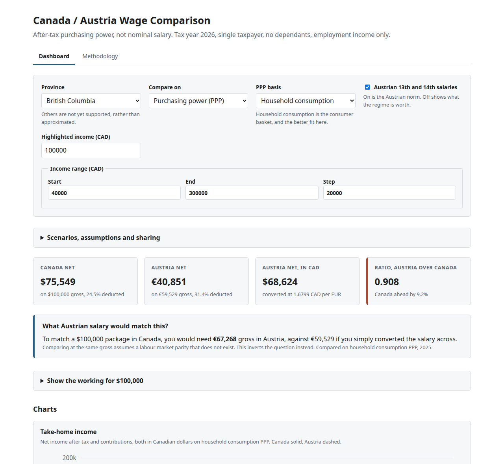

# wage_comp

Interactive tool comparing **after-tax purchasing power** between Canada and
Austria across a configurable gross income range.

**Live: https://ricschuster.github.io/wage_comp/**



## What it does

Gross salary is an input, not an answer. The tool reports:

- Net take-home pay, both countries
- PPP-adjusted take-home pay, both countries
- Effective deduction rate, both countries
- The Austria divided by Canada purchasing-power ratio

It also inverts the question, which is usually the more useful one: given a
Canadian package, what Austrian gross would match it? Comparing at the same
gross assumes a labour-market parity that does not exist.

For British Columbia in 2026, on household consumption PPP:

| Canadian gross | Ratio | Austrian gross needed to match |
| --- | --- | --- |
| $40,000 | 1.078 | €21,965 |
| $60,000 | 0.969 | €37,744 |
| $100,000 | 0.908 | €67,268 |
| $150,000 | 0.886 | €102,214 |
| $300,000 | 0.964 | €185,749 |

Austria is ahead below roughly $45,000, Canada is ahead above it, and the gap
narrows again at the top as Austria's social insurance ceilings bind.

## Design commitments

- **Every tax parameter carries a citation.** Source URL and retrieval date,
  listed in the app's methodology page, which is generated from the parameters
  themselves so it cannot drift out of date.
- **Correctness is tested, not asserted.** Bracket tables are verified against
  the constants CRA publishes in its own payroll formulas, so a transcription
  error fails CI rather than shipping.
- **The model is auditable.** Every figure expands to show the formula, its
  inputs, and a link to the source of each parameter.
- **No backend.** A static site, so nothing to keep alive and nothing to pay
  for. The exchange rate is an adjustable input with a sourced, date-stamped
  default rather than a live fetch.
- **Assumptions are guarded.** Only the conversion factors are adjustable. Tax
  parameters are law, not assumptions, and are not editable.

## Two corrections worth knowing

- The lowest **federal** rate for 2026 is **14%**, not 15%. The 2025 rate cut
  applies in full, and that rate also converts credits.
- CRA's public tax brackets page shows **5.6%** for the first British Columbia
  bracket. The Government of BC and CRA's own T4127 payroll formulas both give
  **5.06%**, which is what this model uses.

## Scope

Single taxpayer, no dependants, employment income only, no voluntary
deductions. Tax year 2026. British Columbia; other provinces are added as
parameter files. Quebec needs its own module (QPP, QPIP, federal abatement) and
is absent rather than approximated.

This is not tax advice and not a filing tool. The in-app methodology page
states what is modelled, what is not, and what the ratio does not tell you.

## Development

Node version is pinned in `.nvmrc`.

```sh
npm ci        # install
npm run dev   # local dev server
npm test      # unit and golden tests
npm run build # production build
```

Full check suite, matching CI:

```sh
npm run format:check
npm run lint
npm run typecheck
npm run test:coverage
npm run build
```

Helper scripts:

```sh
tools/source.sh <url> <name>  # fetch an authoritative source page into tools/cache
tools/screenshot.sh           # regenerate the README screenshot
```

## Repository layout

- `src/engine/` pure, testable tax logic. No React imports.
- `src/data/` tax parameter tables keyed by year, with provenance on every value.
- `src/ui/` React components.
- `docs/design/` design notes, `docs/decisions/` ADRs, `docs/handoffs/` session
  handoffs.

## Contributing

See `CONTRIBUTING.md`. Corrections to tax parameters are especially welcome, and
are most useful with a source link.

## License

GNU General Public License v3.0 or later. See `LICENSE`.
